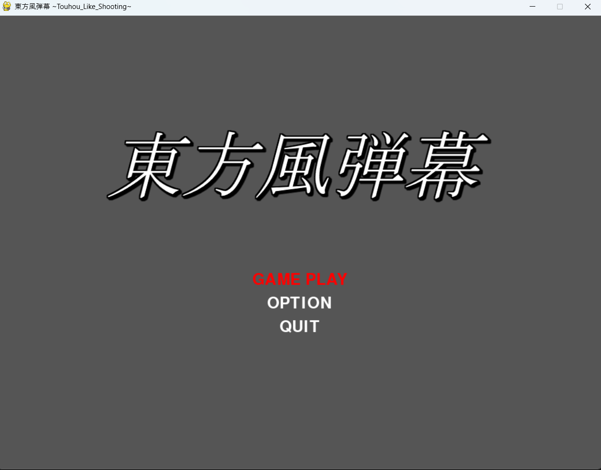
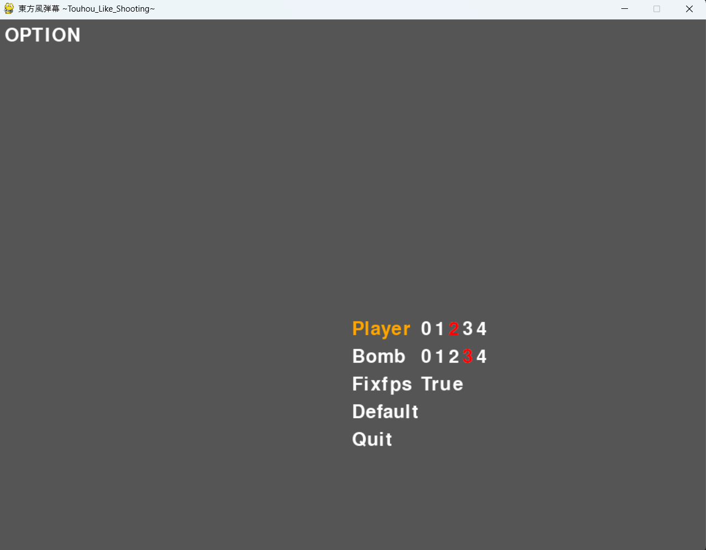
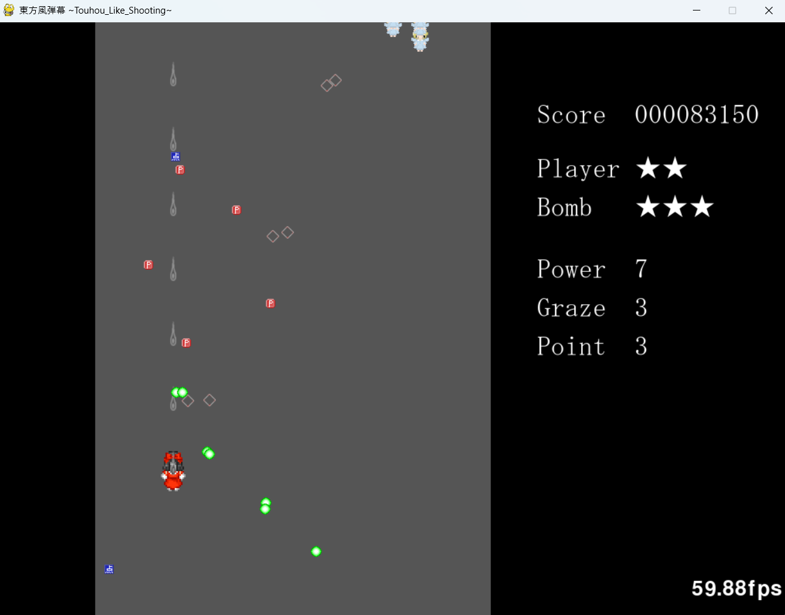
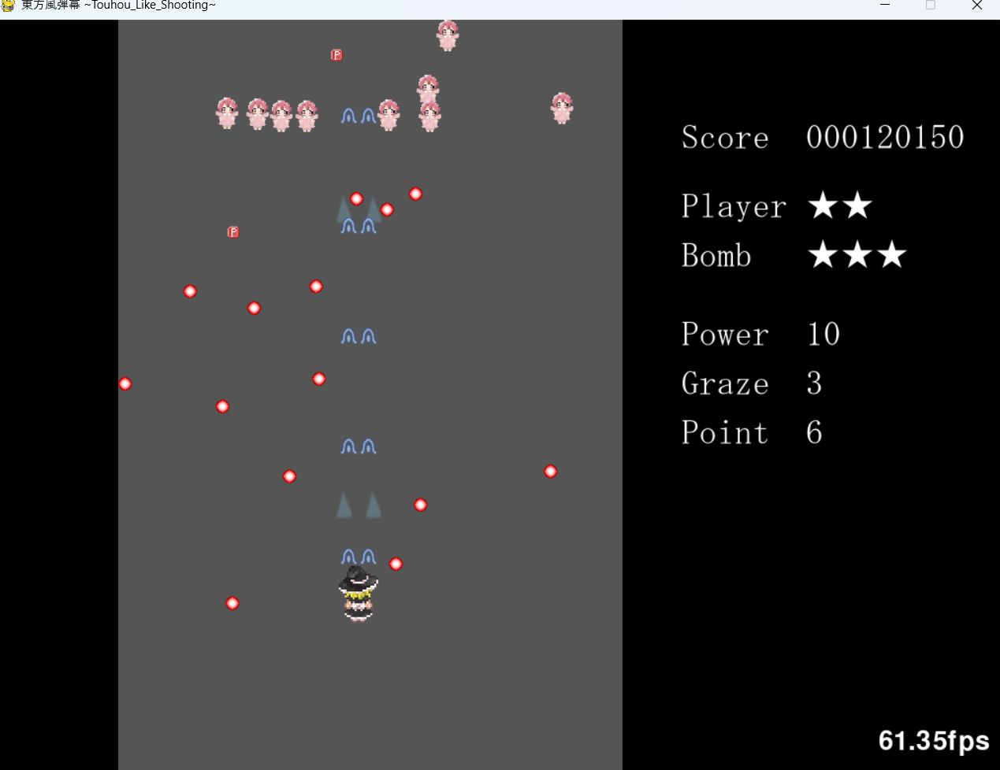
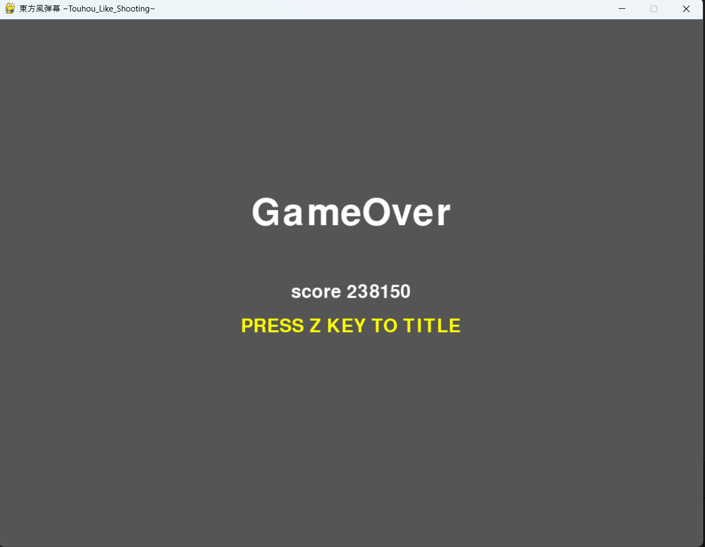

# 東方風弾幕 ~Touhou_Like_Shooting~

## 制作時期

2025年1月

## 作品概要

Pythonのゲームライブラリ「Pygame」を用いて開発した、縦スクロール型の弾幕シューティングゲームです。
敵の弾幕を回避しながら撃破し、スコアを競います。
プレイヤーのパワーアップ要素や、敵弾にかすることでスコアが加算される graze システムを実装しました。

## 実装した機能・特徴

### 1. キャラクター性能の差別化

プレイアブルキャラクターとして「霊夢」と「魔理沙」の2体を実装しました。

- **霊夢**: 攻撃範囲が広く、パワーアップすることで敵を自動追尾する「ホーミング弾」を発射します。初心者向けの機体です。
- **魔理沙**: 攻撃範囲は狭いですが、連射速度と弾速に優れ、高火力の「ミサイル」を発射します。上級者向けの機体です。

### 2. 敵の弾の設計

敵の攻撃パターンにおいて、三角関数（sin/cos）やベクトル計算を活用しました。
単純に真下に放つ弾だけでなく、「円形弾幕」「自機狙い」などの複数攻撃パターンを辞書型データで管理しています。

### 3. オブジェクト指向による設計

プレイヤー、敵、弾、アイテムなどのゲームオブジェクトをクラス化し、管理しています。
特に敵キャラクターは共通の基底クラスを持ち、出現フレームや移動パス、使用する弾幕パターンを引数として渡すことで、効率的にステージデータを生成できるように設計しました。

### 4. ゲームシステムと演出

- **ステートマシンによる画面遷移**: タイトル、ゲーム本編、ポーズ、ゲームオーバー、クリア画面などの状態を管理し、スムーズな画面遷移を実装しました。
- **オプション設定**: プレイヤーの初期残機数やボム数、FPS固定の有無などを変更できるオプション画面を自作UIで実装しました。
- **ヒットボックスの調整**: 弾幕ゲーム特有の「見た目よりも小さい当たり判定」を実装し、ギリギリで避ける緊張感を演出しています。

## 遊び方

### 操作方法

- **矢印キー (↑↓←→)**: 自機の移動
- **Zキー**: ショット発射 / 決定
- **Shiftキー**: 低速移動（精密操作モード）
- **Qキー**: キャラクター切り替え
- **Xキー**: ボム発動（画面内の敵を一掃）
- **ESCキー**: ポーズ / ゲーム終了

## 使用ライブラリ

- pygame

## 素材クレジット

本作品では、以下のサイトの画像素材を使用しています。

- **配布サイト**: [点睛集積 (Dispell.net)](http://dispell.net/)
- **著作者**: 7B / spellyon

## スクリーンショット

